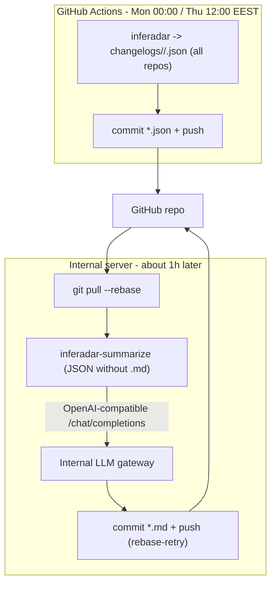

# InfeRadar

InfeRadar tracks merged and newly opened PRs across multiple LLM inference engine
repositories, bins them into deterministic labels as weekly JSON changelogs, and
generates a high-signal markdown digest per repo from that JSON using an
OpenAI-compatible LLM gateway.

Supported repositories:
- [ROCm/AITER](https://github.com/ROCm/aiter)
- [vllm-project/vllm](https://github.com/vllm-project/vllm)
- [sgl-project/sglang](https://github.com/sgl-project/sglang)
- [ROCm/ATOM](https://github.com/ROCm/ATOM)

The JSON is deterministic: labels come from editable path and title rules in
repository-specific YAML files, with no LLM involved; PR bodies are intentionally
ignored to avoid over-classifying copied context, checklists, and broad
release-note text. The markdown digests are derived from that JSON and live right
next to it, so each `.md` is paired one-to-one with its `.json` source of truth.

## Architecture

The pipeline is split across two places, because the LLM gateway is reachable
only inside the company network, while the ROCm repos block classic personal
access tokens (only GitHub's own Actions token can read them):

- GitHub Actions (cloud) generates the deterministic JSON for all repos and
  commits it. Its built-in token reads ROCm fine, and it uses no other secrets.
- An internal server reads that JSON and writes the markdown digests via the
  internal gateway, committing only the `.md` files.

The two writers touch disjoint files (Actions writes `*.json`, the server writes
`*.md`), so they never conflict; the server `git pull --rebase` before pushing.



The gateway key never leaves the server, and GitHub Actions holds no custom
secrets at all - so nothing sensitive ever reaches the public repo.

## Local usage (JSON)

Install:

```bash
python -m pip install -e ".[test]"
```

Generate changelogs for all configured repos:

```bash
inferadar --repos-config repos.yaml --output-dir changelogs
```

Single repo, or a specific window:

```bash
inferadar --repo ROCm/aiter --output-dir changelogs
inferadar --repos-config repos.yaml --start 2026-05-08 --end 2026-05-15 --output-dir changelogs
```

Use `GITHUB_TOKEN` or `GH_TOKEN` to raise GitHub API rate limits. Note: the ROCm
org blocks classic PATs, so the client falls back to anonymous access for those
owners (configurable via `INFERADAR_GITHUB_RAW_OWNERS`, default `ROCm`). Anonymous
access is rate-limited, so busy ROCm repos like AITER are generated in GitHub
Actions instead, whose built-in token can read them.

## Markdown summaries

`inferadar-summarize` reads each changelog JSON and writes a digest next to it
(`changelogs/<window>/<repo>.md`). It is idempotent: a `.md` is only
(re)generated when its `.json` is newer, or with `--force`.

```bash
# needs the LLM extra:
python -m pip install -e ".[llm]"

inferadar-summarize --changelogs-dir changelogs            # all windows, missing/stale only
inferadar-summarize --window latest --force                # rebuild the newest window
inferadar-summarize --start 2026-06-01 --end 2026-06-08    # one specific window
inferadar-summarize --only AITER --window latest           # a single repo (one gateway call)
```

Configure the gateway entirely via environment variables (any OpenAI-compatible
`/chat/completions` endpoint works; nothing is hard-coded):

| Variable | Required | Notes |
| --- | --- | --- |
| `INFERADAR_LLM_BASE_URL` | yes | Base URL incl. version path, e.g. `https://gw.internal/v1` |
| `INFERADAR_LLM_API_KEY` | yes | Credential for the gateway |
| `INFERADAR_LLM_MODEL` | yes | Model name served by the gateway |
| `INFERADAR_LLM_AUTH_HEADER` | no | Auth header name (default `Authorization`) |
| `INFERADAR_LLM_AUTH_PREFIX` | no | Value prefix (default `Bearer `; set empty for a bare key) |
| `INFERADAR_LLM_TIMEOUT` | no | Read timeout seconds (default 300) |
| `INFERADAR_LLM_MAX_TOKENS` | no | Output token budget (default 64000) |
| `INFERADAR_LLM_MAX_TOKENS_CAP` | no | Ceiling for the empty-content retry (default 64000) |
| `INFERADAR_LLM_EMPTY_RETRIES` | no | Extra attempts on empty content, escalating the budget (default 2) |

Reasoning models (like the default `gemini-3.1-pro-preview`) spend part of the
output budget on hidden "thinking", which can leave zero visible text on a tight
budget. The default budget is therefore high (64000, the model's max output), and
if the model still returns empty content the client retries with a doubled budget
(up to `INFERADAR_LLM_MAX_TOKENS_CAP`). If you point at a model with a smaller max
output (e.g. 8192/16384), lower both `INFERADAR_LLM_MAX_TOKENS` and
`INFERADAR_LLM_MAX_TOKENS_CAP` to that limit.

For the AMD internal gateway (an Azure API Management front door) set
`INFERADAR_LLM_BASE_URL=https://llm-api.amd.com/api/v1`,
`INFERADAR_LLM_AUTH_HEADER=Ocp-Apim-Subscription-Key`, and `INFERADAR_LLM_AUTH_PREFIX=`
(empty). The default model is `gemini-3.1-pro-preview`. Alternatives:
`Claude-Opus-4.8` (~3x faster, curated, supports 128000 output) or
`Claude-Sonnet-4.5` (most reliable). See
[`deploy/inferadar.env.example`](deploy/inferadar.env.example).

Each digest has a fixed shape: a `## TL;DR` (which model families got the most
attention, the most needle-moving performance PRs), `## Most important PRs` (the
top ~5, written up), then `## More changes by area` where the long tail is
grouped into collapsed `<details>` boxes by type of work, one line per PR. The
visible content (everything outside the boxes) is sized for a 60-75 second read.

Notification-safe by design: digests contain no `@mentions`, PR references are
emitted as full-URL links, and commit messages are sanitized, so generating and
committing summaries never pings a PR author.

## Output layout

```text
changelogs/
└── 2026-06-01_to_2026-06-08/
    ├── AITER.json
    ├── AITER.md
    ├── vllm.json
    ├── vllm.md
    ├── sglang.json
    ├── sglang.md
    ├── ATOM.json
    └── ATOM.md
```

Each JSON artifact includes the query window, state counts, primary and auxiliary
label counts, PR metadata, changed files, commit SHAs, labels, and capped rule
reasons. Merged PRs receive the `merged` label; PRs opened during the same window
receive `open_pr`.

## Configuration

Repositories are configured in `repos.yaml`, each with its own rules file:

```yaml
repos:
  - name: AITER
    github: ROCm/AITER
    rules: rules/rules-aiter.yaml
  - name: vllm
    github: vllm-project/vllm
    rules: rules/rules-vllm.yaml
```

## How the JSON is generated (GitHub Actions)

`.github/workflows/generate-changelogs.yml` generates and commits the JSON for
all repos on schedule (Mon 00:00 / Thu 12:00 EEST) and on manual dispatch. It
runs in the cloud because the built-in `GITHUB_TOKEN` is an app installation
token (not a classic PAT), so it can read ROCm repos that block classic PATs; it
sets `INFERADAR_GITHUB_RAW_OWNERS=""` so every owner is fetched with that token.
No custom secrets are used. Trigger it manually from the Actions tab (optionally
with start/end dates or dry_run).

## Markdown stage on an internal server

The gateway is internal-only, so the markdown step runs on an always-on internal
server. It pulls the JSON that Actions committed, writes the digests via the
gateway, and commits only the `.md` files. Because Actions writes `*.json` and
the server writes `*.md`, the two never conflict; the server `git pull --rebase`
before pushing and retries if Actions pushed concurrently. Your laptop/VPN is
irrelevant - the server lives inside the network and runs on its own schedule.

Install:

```bash
sudo mkdir -p /opt/inferadar && sudo chown "$USER" /opt/inferadar
git clone git@github.com:akii96/infeRadar.git /opt/inferadar
cd /opt/inferadar
python3 -m venv .venv
.venv/bin/pip install -e ".[llm]"

sudo mkdir -p /etc/inferadar
sudo install -m 600 deploy/inferadar.env.example /etc/inferadar/inferadar.env
sudo "$EDITOR" /etc/inferadar/inferadar.env   # gateway URL/key/model + PYTHON (no GitHub token needed)
```

Push credential (recommended: SSH deploy key with write access):

```bash
ssh-keygen -t ed25519 -f ~/.ssh/inferadar_deploy -N ""
# Add ~/.ssh/inferadar_deploy.pub to the repo: Settings -> Deploy keys ->
# "Allow write access". Keep the git remote as SSH. The service User= must own
# this key. (Alternative: an HTTPS remote with a stored token.)
```

Schedule with systemd (about 3 hours after the Actions JSON):

```bash
sudo cp deploy/inferadar.service deploy/inferadar.timer /etc/systemd/system/
# edit WorkingDirectory / ExecStart / User in the .service, and the timezone in
# the .timer, to match your install.
sudo systemctl daemon-reload
sudo systemctl enable --now inferadar.timer
systemctl list-timers inferadar.timer
```

Runs are Monday 03:00 and Thursday 15:00 EEST (3 hours after Actions generates
the JSON, leaving margin for the Actions run and any retries). `Persistent=true`
catches up a run missed while the server was down.

cron alternative:

```cron
CRON_TZ=Europe/Athens
0 3  * * 1  /opt/inferadar/deploy/run-inferadar.sh   # Mon 03:00 EEST
0 15 * * 4  /opt/inferadar/deploy/run-inferadar.sh   # Thu 15:00 EEST
```

Manual and custom runs:

```bash
# summarize the latest window now, without pushing (smoke test):
INFERADAR_SKIP_PUSH=1 deploy/run-inferadar.sh
# a specific window (both dates required):
deploy/run-inferadar.sh 2026-06-06 2026-06-10
# trigger the service once and watch logs:
sudo systemctl start inferadar.service && journalctl -u inferadar.service -f
```

## Security

- The gateway key lives only in `/etc/inferadar/inferadar.env` (chmod 600) on the
  server; it is never a GitHub secret and never printed.
- GitHub Actions uses only the built-in `GITHUB_TOKEN` (no custom secrets), so a
  fork pull request has nothing to exfiltrate.
- The server's git push uses a per-repo SSH deploy key (write) or an HTTPS remote
  with a stored token.
- Generated markdown has no `@mentions` and links PRs by full URL; commit
  messages are sanitized, so committing never cross-references or notifies a PR.

## Automation

- `.github/workflows/generate-changelogs.yml` - generates and commits the JSON
  for all repos on schedule and manual dispatch, using only the built-in token.
- `.github/workflows/ci.yml` - runs `pytest` on push, pull request, and dispatch.

Markdown summarization runs on the internal server (above), not in the cloud.
