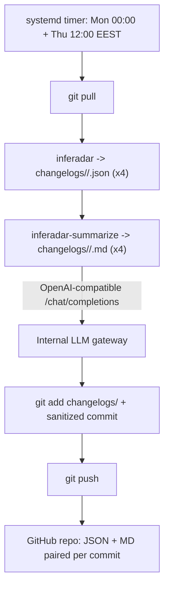

# InfeRadar

InfeRadar tracks merged and newly opened PRs across multiple LLM inference engine
repositories, bins them into deterministic labels as weekly JSON changelogs, and
generates a high-signal markdown digest per repo from that JSON using an
OpenAI-compatible LLM gateway.

Supported repositories:
- [ROCm/AITER](https://github.com/ROCm/aiter)
- [vllm-project/vllm](https://github.com/vllm-project/vllm)
- [sgl-project/sglang](https://github.com/sgl-project/sglang)
- [ROCm/ATOM](https://github.com/ROCm/ATOM)

The JSON is deterministic: labels come from editable path and title rules in
repository-specific YAML files, with no LLM involved; PR bodies are intentionally
ignored to avoid over-classifying copied context, checklists, and broad
release-note text. The markdown digests are derived from that JSON and live right
next to it, so each `.md` is paired one-to-one with its `.json` source of truth.

## Architecture

The pipeline runs in two sequential stages on an internal server, because the
LLM gateway is reachable only inside the company network:



The gateway key never leaves the server; GitHub only ever receives the committed
files. GitHub Actions runs the tests only (no generation, no secrets).

## Local usage (JSON)

Install:

```bash
python -m pip install -e ".[test]"
```

Generate changelogs for all configured repos:

```bash
inferadar --repos-config repos.yaml --output-dir changelogs
```

Single repo, or a specific window:

```bash
inferadar --repo ROCm/aiter --output-dir changelogs
inferadar --repos-config repos.yaml --start 2026-05-08 --end 2026-05-15 --output-dir changelogs
```

Use `GITHUB_TOKEN` or `GH_TOKEN` to raise GitHub API rate limits.

## Markdown summaries

`inferadar-summarize` reads each changelog JSON and writes a digest next to it
(`changelogs/<window>/<repo>.md`). It is idempotent: a `.md` is only
(re)generated when its `.json` is newer, or with `--force`.

```bash
# needs the LLM extra:
python -m pip install -e ".[llm]"

inferadar-summarize --changelogs-dir changelogs            # all windows, missing/stale only
inferadar-summarize --window latest --force                # rebuild the newest window
inferadar-summarize --start 2026-06-01 --end 2026-06-08    # one specific window
inferadar-summarize --only AITER --window latest           # a single repo (one gateway call)
```

Configure the gateway entirely via environment variables (any OpenAI-compatible
`/chat/completions` endpoint works; nothing is hard-coded):

| Variable | Required | Notes |
| --- | --- | --- |
| `INFERADAR_LLM_BASE_URL` | yes | Base URL incl. version path, e.g. `https://gw.internal/v1` |
| `INFERADAR_LLM_API_KEY` | yes | Credential for the gateway |
| `INFERADAR_LLM_MODEL` | yes | Model name served by the gateway |
| `INFERADAR_LLM_AUTH_HEADER` | no | Auth header name (default `Authorization`) |
| `INFERADAR_LLM_AUTH_PREFIX` | no | Value prefix (default `Bearer `; set empty for a bare key) |
| `INFERADAR_LLM_TIMEOUT` | no | Read timeout seconds (default 300) |
| `INFERADAR_LLM_MAX_TOKENS` | no | Output token budget (default 4096) |

For the AMD internal gateway (an Azure API Management front door) set
`INFERADAR_LLM_BASE_URL=https://llm-api.amd.com/api/v1`,
`INFERADAR_LLM_AUTH_HEADER=Ocp-Apim-Subscription-Key`, and `INFERADAR_LLM_AUTH_PREFIX=`
(empty). The default model is `gemini-3.1-pro-preview`; since it is a reasoning
model, also set `INFERADAR_LLM_MAX_TOKENS=24000` so the digest is not truncated.
Alternatives: `Claude-Opus-4.8` (~3x faster, curated) or `Claude-Sonnet-4.5` (most
reliable). See [`deploy/inferadar.env.example`](deploy/inferadar.env.example).

Each digest has a fixed shape: a `## TL;DR` (which model families got the most
attention, the most needle-moving performance PRs), `## Most important PRs` (the
top ~5, written up), then `## More changes by area` where the long tail is
grouped into collapsed `<details>` boxes by type of work, one line per PR. The
visible content (everything outside the boxes) is sized for a 60-75 second read.

Notification-safe by design: digests contain no `@mentions`, PR references are
emitted as full-URL links, and commit messages are sanitized, so generating and
committing summaries never pings a PR author.

## Output layout

```text
changelogs/
└── 2026-06-01_to_2026-06-08/
    ├── AITER.json
    ├── AITER.md
    ├── vllm.json
    ├── vllm.md
    ├── sglang.json
    ├── sglang.md
    ├── ATOM.json
    └── ATOM.md
```

Each JSON artifact includes the query window, state counts, primary and auxiliary
label counts, PR metadata, changed files, commit SHAs, labels, and capped rule
reasons. Merged PRs receive the `merged` label; PRs opened during the same window
receive `open_pr`.

## Configuration

Repositories are configured in `repos.yaml`, each with its own rules file:

```yaml
repos:
  - name: AITER
    github: ROCm/AITER
    rules: rules/rules-aiter.yaml
  - name: vllm
    github: vllm-project/vllm
    rules: rules/rules-vllm.yaml
```

## Scheduled runs on an internal server

The gateway is internal-only, so the markdown step cannot run on GitHub's cloud.
Running the whole pipeline on an always-on internal server keeps JSON and
markdown sequential and committed together, and keeps the key off GitHub. Your
laptop/VPN is irrelevant: the server lives inside the network and runs on its own
schedule whether or not your laptop is on.

Install:

```bash
sudo mkdir -p /opt/inferadar && sudo chown "$USER" /opt/inferadar
git clone git@github.com:akii96/infeRadar.git /opt/inferadar
cd /opt/inferadar
python3 -m venv .venv
.venv/bin/pip install -e ".[llm]"

sudo mkdir -p /etc/inferadar
sudo install -m 600 deploy/inferadar.env.example /etc/inferadar/inferadar.env
sudo "$EDITOR" /etc/inferadar/inferadar.env   # gateway URL/key/model + GITHUB_TOKEN + PYTHON
```

Push credential (recommended: SSH deploy key with write access):

```bash
ssh-keygen -t ed25519 -f ~/.ssh/inferadar_deploy -N ""
# Add ~/.ssh/inferadar_deploy.pub to the repo: Settings -> Deploy keys ->
# "Allow write access". Keep the git remote as SSH. The service User= must own
# this key. (Alternative: an HTTPS remote with a fine-grained PAT.)
```

Schedule with systemd:

```bash
sudo cp deploy/inferadar.service deploy/inferadar.timer /etc/systemd/system/
# edit WorkingDirectory / ExecStart / User in the .service, and the timezone in
# the .timer, to match your install.
sudo systemctl daemon-reload
sudo systemctl enable --now inferadar.timer
systemctl list-timers inferadar.timer
```

Runs are Monday 00:00 and Thursday 12:00 EEST (the Sunday->Monday midnight and
the 3.5-day midpoint). `Persistent=true` catches up a run missed while the server
was down.

cron alternative:

```cron
CRON_TZ=Europe/Athens
0 0  * * 1  /opt/inferadar/deploy/run-inferadar.sh   # Mon 00:00 EEST
0 12 * * 4  /opt/inferadar/deploy/run-inferadar.sh   # Thu 12:00 EEST
```

Manual and custom runs:

```bash
# full pipeline now, without pushing (smoke test):
INFERADAR_SKIP_PUSH=1 deploy/run-inferadar.sh
# custom date window (both dates required):
deploy/run-inferadar.sh 2026-06-01 2026-06-08
# trigger the service once and watch logs:
sudo systemctl start inferadar.service && journalctl -u inferadar.service -f
```

## Security

- The gateway key and `GITHUB_TOKEN` live only in `/etc/inferadar/inferadar.env`
  (chmod 600) on the server; they are never GitHub secrets and are never printed.
- Push uses a per-repo SSH deploy key (write) or a fine-grained PAT scoped to
  this repo only.
- The cloud CI workflow uses no secrets and only runs tests, so a fork pull
  request cannot exfiltrate anything.
- Generated markdown has no `@mentions` and links PRs by full URL; commit
  messages are sanitized, so committing never cross-references or notifies a PR.

## Automation (CI)

`.github/workflows/ci.yml` runs `pytest` on push, pull request, and manual
dispatch. All changelog generation and summarization happen on the internal
server, not in the cloud.
